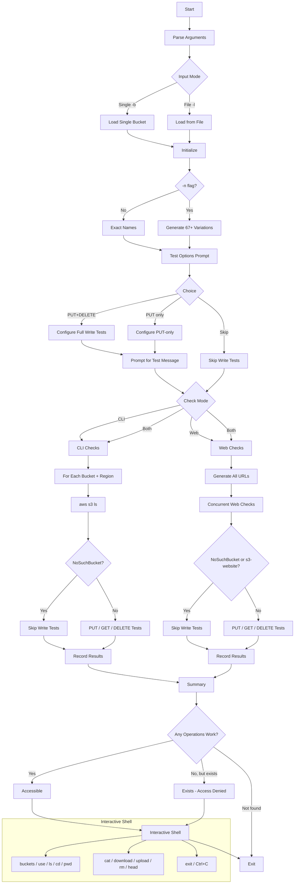

<a href="https://www.buymeacoffee.com/0xDTC"></a>

# 0xS3

A comprehensive S3 bucket accessibility scanner written in Go. Tests for publicly accessible buckets across all AWS regions using both AWS CLI and web-based checks. Tests bucket permissions for PUT, GET, and DELETE operations to identify write access even when bucket listing is denied. Drops into an interactive shell after scanning for direct bucket interaction.

**Zero external dependencies** - uses only the Go standard library.

## Features

- **Single & Bulk Mode**: Check individual buckets or lists from files
- **Name Variations**: Generate and test 67+ common bucket naming patterns (optional `-n` flag)
- **Multi-Region Scanning**: Checks buckets across 30 AWS regions
- **Dual Testing**: Both AWS CLI (`--no-sign-request`) and web-based endpoint testing
- **Write Operations**: Test PUT, GET, and DELETE operations even when bucket listing is denied
- **Smart Summary**: Distinguishes "accessible" (operations work) from "exists but access denied" (bucket found but no operations succeed)
- **NoSuchBucket Skip**: Automatically skips write tests on non-existent buckets to save time
- **Website Endpoint Skip**: Skips write tests on `s3-website` endpoints (they only support GET/HEAD, preventing false positives)
- **Concurrent Processing**: Multi-threaded web scanning with configurable thread count
- **Interactive Shell**: Post-scan REPL for browsing, downloading, uploading, and deleting objects
- **Detailed Logging**: Verbose output and progress tracking
- **Color-coded Output**: Red for HTTP, green for HTTPS
- Multiple URL formats per bucket variation:
  - Direct bucket access (`bucket.com`)
  - Standard S3 endpoints (`bucket.s3.amazonaws.com`)
  - Regional endpoints (`bucket.s3.region.amazonaws.com`)
  - Hyphenated endpoints (`bucket.s3-region.amazonaws.com`)
  - Website endpoints (`bucket.s3-website.region.amazonaws.com`)
  - Dualstack endpoints (`bucket.s3.dualstack.region.amazonaws.com`)

## Build

```bash
cd 0xS3
go build -o 0xS3 ./0xS3.go
```

## Usage

### Basic Usage
```bash
# Check single bucket across all regions
./0xS3 -b mybucket

# Check multiple buckets from file (requires -w or -c)
./0xS3 -l buckets.txt -w

# Check with name variations
./0xS3 -b mybucket -n

# Check file list with name variations (requires -w or -c)
./0xS3 -l buckets.txt -n -w
```

### Advanced Usage
```bash
# Web checks only
./0xS3 -b mybucket -w

# CLI checks only
./0xS3 -b mybucket -c

# Verbose output
./0xS3 -b mybucket -v

# Custom thread count
./0xS3 -b mybucket -t 50

# File list with CLI checks only
./0xS3 -l buckets.txt -c

# Combined options (file list requires -w or -c)
./0xS3 -l buckets.txt -n -w -v -t 20
```

### Options
| Flag | Long Form | Description |
|------|-----------|-------------|
| `-b` | `--bucket` | Single bucket name to check |
| `-l` | `--list` | File containing bucket names (one per line) |
| `-n` | `--name-variations` | Generate and test bucket name variations |
| `-c` | `--cli-only` | Only perform AWS CLI checks |
| `-w` | `--web-only` | Only perform web checks |
| `-v` | `--verbose` | Show verbose output (all attempts) |
| `-t` | `--threads` | Number of concurrent threads for web checks (default: 30) |

**Important Notes**:
- `-b` and `-l` are mutually exclusive
- When using `-l` flag, you **must** specify either `-w` or `-c` to prevent accidental resource-intensive scans
- For single buckets (`-b`), both CLI and web checks are performed by default

## Interactive Shell

After scanning, if any accessible buckets are found, 0xS3 drops into an interactive shell. If only one bucket was found, it is auto-selected.

### Shell Commands

| Command | Aliases | Description |
|---------|---------|-------------|
| `buckets` | | List all found buckets with mode, region, URL, and capabilities |
| `use <bucket> [web\|cli]` | `use <number>` | Select active bucket |
| `ls [prefix]` | `dir` | List objects in current prefix |
| `cd <path>` | | Change prefix (`..` = up, `/` = root) |
| `pwd` | | Show current `s3://bucket/prefix` |
| `cat <key>` | | Print object contents to stdout |
| `download <key> [local]` | `dl`, `get` | Download object to local file |
| `upload <local> <key>` | `ul`, `put` | Upload local file to bucket |
| `rm <key>` | `del`, `delete` | Delete an object |
| `head <key>` | `info` | Show object metadata |
| `help` | `?` | Show commands |
| `exit` | `quit`, Ctrl+C | Exit shell |

Keys are relative to the current prefix. Use `/key` for absolute paths.

Each command automatically uses the correct backend (AWS CLI or HTTP) based on how the bucket was originally discovered.

### Shell Example
```
=== Interactive Shell ===
Type 'help' for available commands, 'exit' or Ctrl+C to quit.

Auto-selected bucket: mybucket (web mode)

0xS3:mybucket> ls
  PRE  images/
  PRE  logs/
  2024-01-15T10:30:00.000Z       1234  config.json
  2024-02-20T14:22:00.000Z      56789  readme.txt

0xS3:mybucket> cd images
0xS3:mybucket/images> ls
  2024-03-01T08:00:00.000Z     102400  logo.png
  2024-03-01T08:00:00.000Z      51200  banner.jpg

0xS3:mybucket/images> download logo.png
Downloaded 102400 bytes to: logo.png

0xS3:mybucket/images> cd ..
0xS3:mybucket> cat readme.txt
Hello world!

0xS3:mybucket> head config.json
HTTP 200
  Content-Type: application/json
  Content-Length: 1234
  Last-Modified: Mon, 15 Jan 2024 10:30:00 GMT
  ETag: "abc123"

0xS3:mybucket> exit
Bye.
```

## Input File Format

When using the `-l` option, create a text file with bucket names:

```text
# Company buckets to check
company-prod
company-staging
company-dev

# Partner buckets
partner-bucket
external-storage
```

**File Format Rules:**
- One bucket name per line
- Lines starting with `#` are treated as comments
- Empty lines are ignored
- Leading/trailing whitespace is automatically trimmed

## Mandatory Flags for Bulk Operations

When using the `-l` flag for bulk bucket checking, you **must** specify either `-w` (web-only) or `-c` (cli-only) to prevent accidental resource-intensive scans.

**Why This Requirement Exists:**
- **Resource Protection**: Bulk operations can generate thousands of requests across multiple regions
- **Performance Control**: Forces users to choose the most appropriate scanning method
- **Accidental Prevention**: Prevents unintended massive scans that could trigger rate limits

```bash
# Valid
./0xS3 -l buckets.txt -w
./0xS3 -l buckets.txt -c

# Invalid - will show error
./0xS3 -l buckets.txt
```

## Examples

### Single Bucket Mode
```bash
./0xS3 -b acme-corp.com
```

Example Output (bucket with working operations):
```
==== S3 Bucket Accessibility Check ====
Base name: acme-corp.com
Mode: Both Web and CLI checks (exact names only (1 total))
Regions to check: 30

Choose testing options:
  p - Test PUT and GET operations (skip DELETE)
  b - Test PUT, GET, and DELETE operations
  s - Skip all write tests (no PUT, GET, or DELETE)
Your choice [b/p/s]: b
Will perform PUT, GET, and DELETE checks.

Enter the message to put in your test file (cannot be empty):
> This is a security test. Contact security@example.com if found.
Using test message: 'This is a security test. Contact security@example.com if found.'

Checking CLI access for 1 base bucket(s) across 30 regions...
[AWS CLI] Found: s3://acme-corp.com No Region (objects: 1342) (PUT, GET, DELETE)
[AWS CLI] Found: s3://acme-corp.com us-east-1 (objects: 1342) (PUT, GET)
[AWS CLI] Not accessible: s3://acme-corp.com us-east-2 (NoSuchBucket)

Checking web endpoints for bucket 'acme-corp.com'...
[Web] Accessible: http://acme-corp.com.s3.amazonaws.com (PUT, GET, DELETE)
[Web] Found (Access Denied): http://acme-corp.com.s3.us-west-2.amazonaws.com

Base bucket 'acme-corp.com' is accessible!

=== Interactive Shell ===
Type 'help' for available commands, 'exit' or Ctrl+C to quit.
0xS3:acme-corp.com>
```

Example Output (bucket exists but fully denied):
```
Checking CLI access for 1 base bucket(s) across 30 regions...
[AWS CLI] Not accessible: s3://locked-bucket No Region (AccessDenied)
[AWS CLI] Not accessible: s3://locked-bucket us-east-1 (AccessDenied)
...

Checking web endpoints for bucket 'locked-bucket'...
[Web] Found (Access Denied): https://locked-bucket.s3.amazonaws.com
[Web] Found (Access Denied): https://locked-bucket.s3.us-east-1.amazonaws.com

Base bucket 'locked-bucket' exists but access is denied (no operations succeeded).
```

### Multiple Buckets Mode
```bash
./0xS3 -l buckets.txt -w
```

### Name Variations Mode
```bash
./0xS3 -b mybucket -n
```

## How Write Testing Works

When scanning, 0xS3 tests PUT, GET, and DELETE operations regardless of whether listing succeeds. This catches misconfigured buckets where listing is denied but write operations are open.

### Test Flow

1. **LIST** — `aws s3 ls` (CLI) or HTTP GET for XML listing (web)
2. **PUT** — Upload a test file with your custom message (runs even if LIST was denied)
3. **GET** — Read back the same test file that was just uploaded (only if PUT succeeded)
4. **DELETE** — Remove the test file (only if PUT succeeded and DELETE testing is enabled)

GET depends on PUT because it reads back the file you just uploaded — if PUT failed, there's nothing to GET.

### When Write Tests Are Skipped

| Response | Meaning | Write Tests |
|----------|---------|-------------|
| **NoSuchBucket** | Bucket does not exist at all | Skipped — nothing to write to |
| **s3-website endpoint** | Static website hosting URL | Skipped — only supports GET/HEAD, would produce false positives |
| **AccessDenied (403)** | Bucket exists but listing is denied | **Tested** — PUT/DELETE may still work due to misconfigured permissions |
| **200 + ListBucketResult** | Bucket exists and is publicly listable | **Tested** |

### Summary Reporting

The final summary distinguishes between buckets that are actually usable and those that just exist:

- **Accessible** — At least one operation works (LIST, PUT, GET, or DELETE)
- **Exists but access denied** — Bucket was detected (403 AccessDenied) but no operations succeeded

```
Base bucket 'mybucket' is accessible!                                    # something works
Base bucket 'mybucket' exists but access is denied (no operations succeeded).  # nothing works
```

## Bucket Name Variations

When using the `-n` flag, the tool generates 67+ variations of each bucket name:

- **Standard**: `bucket`, `www.bucket`, `bucket-www`, `bucket.com`, `www.bucket.com`
- **Environment**: `-dev`, `-staging`, `-test`, `-qa`, `-prod` (prefix and suffix)
- **Service**: `-logs`, `-backups`, `-archive`, `-resources`, `-files`, `-images`, `-static`, `-uploads`, `-cdn`, `-content`, `-assets`, `-config`, `-data`, `-api`
- **Format**: underscores, hyphens, dots, `s3-` prefix, `-v1`/`-v2`, `-old`/`-new`
- **Domain**: `.com-dev`, `.com-test`, `.com-prod` and reverse

## Regions Covered

30 AWS regions are checked:

- **US**: us-east-1, us-east-2, us-west-1, us-west-2
- **EU**: eu-central-1, eu-west-1, eu-west-2, eu-west-3, eu-north-1, eu-south-1
- **Asia Pacific**: ap-east-1, ap-southeast-1, ap-southeast-2, ap-southeast-3, ap-northeast-1, ap-northeast-2, ap-northeast-3, ap-south-1
- **Other**: ca-central-1, sa-east-1, af-south-1, me-south-1, me-central-1
- **Gov Cloud**: us-gov-east-1, us-gov-west-1
- **China**: cn-north-1, cn-northwest-1
- **ISO**: us-iso-east-1, us-iso-west-1, us-isob-east-1

## Security Considerations

1. **Defensive Use Only**: This tool is intended for security testing of your own infrastructure or with explicit authorization
2. **Write Testing**: PUT/DELETE operations are optional and should be used carefully
3. **Rate Limiting**: Concurrent request limiting included to avoid overwhelming services
4. **Credentials**: No AWS credentials are required - uses `--no-sign-request` for public bucket enumeration

## Requirements

- **Go 1.24+** (build only)
- **AWS CLI** (optional, for CLI checks - use `-w` for web-only if not installed)

## Workflow



## Note

This tool is for authorized security testing purposes only. Use responsibly and with proper authorization.
