<a href="https://www.buymeacoffee.com/0xDTC"></a>

# AWS Security Scripts

## s3_regions.py

A comprehensive S3 bucket accessibility checker that tests for publicly accessible buckets across all AWS regions, using both AWS CLI and web-based checks. Tests bucket permissions for GET, PUT, and DELETE operations to identify full write access.

### Features
- **Single & Bulk Mode**: Check individual buckets or lists from files
- **Name Variations**: Generate and test common bucket naming patterns (optional)
- **Multi-Region Scanning**: Checks buckets across all AWS regions
- **Dual Testing**: Both AWS CLI and web-based endpoint testing
- **Write Operations**: Test PUT and DELETE operations on accessible buckets
- **Concurrent Processing**: Multi-threaded scanning for efficiency
- **Detailed Logging**: Verbose output and progress tracking
- Tests bucket accessibility via HTTP and HTTPS
- Checks AWS CLI access across all AWS regions
- Tests PUT and DELETE permissions via both AWS CLI and HTTP/S
- Tests over 70 bucket name variations and patterns (when `-n` flag is used)
- Checks multiple URL formats for each bucket variation:
  - Direct bucket access (bucket.com)
  - Standard S3 endpoints (bucket.s3.amazonaws.com)
  - Regional endpoints (bucket.s3.region.amazonaws.com)
  - Hyphenated endpoints (bucket.s3-region.amazonaws.com)
  - Website endpoints (bucket.s3-website.region.amazonaws.com)
  - Dualstack endpoints (bucket.s3.dualstack.region.amazonaws.com)
- Extended S3 feature support including requester pays settings
- Flexible testing options: test only PUT, test both PUT and DELETE, or skip all write tests entirely
- Color-coded output (red for HTTP, green for HTTPS)
- Threaded concurrent processing for faster results
- Progress counter for visibility
- Real-time feedback on accessible buckets
- Automatic TLS/SSL certificate validation bypass for HTTPS endpoints
- Configurable concurrency via thread control

### Usage

#### Basic Usage
```bash
# Check single bucket across all regions
python3 s3_regions.py -b mybucket

# Check multiple buckets from file (requires -w or -c)
python3 s3_regions.py -l buckets.txt -w

# Check with name variations
python3 s3_regions.py -b mybucket -n

# Check file list with name variations (requires -w or -c)
python3 s3_regions.py -l buckets.txt -n -w
```

#### Advanced Usage
```bash
# Web checks only
python3 s3_regions.py -b mybucket -w

# CLI checks only
python3 s3_regions.py -b mybucket -c

# Verbose output
python3 s3_regions.py -b mybucket -v

# Custom thread count
python3 s3_regions.py -b mybucket -t 50

# File list with CLI checks only
python3 s3_regions.py -l buckets.txt -c

# Combined options (file list requires -w or -c)
python3 s3_regions.py -l buckets.txt -n -w -v -t 20
```

#### Options
- `-b, --bucket`: Single bucket name to check
- `-l, --list`: File containing bucket names (one per line) **⚠️ Requires -w or -c flag**
- `-n, --name-variations`: Generate and test bucket name variations
- `-c, --cli-only`: Only perform AWS CLI checks
- `-w, --web-only`: Only perform web checks
- `-v, --verbose`: Show verbose output (all attempts)
- `-t, --threads`: Number of concurrent threads for web checks (default: 30)

**Important Notes**: 
- `-b` and `-l` are mutually exclusive
- When using `-l` flag, you **must** specify either `-w` or `-c` (or both) to prevent accidental resource-intensive scans
- For single buckets (`-b`), both CLI and web checks are performed by default

### Input File Format

When using the `-l` option, create a text file with bucket names:

```text
# Company buckets to check
company-prod
company-staging
company-dev

# Partner buckets
partner-bucket
external-storage

# Test buckets
test-bucket-1
test-bucket-2
```

**File Format Rules:**
- One bucket name per line
- Lines starting with `#` are treated as comments
- Empty lines are ignored
- Leading/trailing whitespace is automatically trimmed

### Mandatory Flags for Bulk Operations

⚠️ **Important**: When using the `-l` flag for bulk bucket checking, you **must** specify either `-w` (web-only) or `-c` (CLI-only) to prevent accidental resource-intensive scans.

#### Why This Requirement Exists:
- **Resource Protection**: Bulk operations can generate thousands of requests across multiple regions
- **Performance Control**: Forces users to choose the most appropriate scanning method
- **Accidental Prevention**: Prevents unintended massive scans that could impact performance or trigger rate limits

#### Valid Combinations:
```bash
# ✅ Correct - Web checks only
python3 s3_regions.py -l buckets.txt -w

# ✅ Correct - CLI checks only  
python3 s3_regions.py -l buckets.txt -c

# ✅ Correct - Both methods (use with caution for large lists)
python3 s3_regions.py -l buckets.txt -w -c

# ❌ Invalid - Will show error
python3 s3_regions.py -l buckets.txt
```

### Examples

#### Single Bucket Mode
```bash
python3 s3_regions.py -b acme-corp.com
```

Example Output:
```
==== S3 Bucket Accessibility Check ====
Base name: acme-corp.com
Mode: Both Web and CLI checks (exact names only (1 total))
Regions to check: 30

Choose testing options:
  p - Test ONLY PUT operations (skip DELETE)
  b - Test both PUT and DELETE operations
  s - Skip all write tests (no PUT or DELETE)
Your choice [b/p/s]: b
Will perform both PUT and DELETE checks.

Enter the message to put in your test file (cannot be empty):
> This is a security test. Contact security@example.com if found.
Using test message: 'This is a security test. Contact security@example.com if found.'

Checking CLI access for 1 base bucket(s) across 30 regions...
[AWS CLI] Found: s3://acme-corp.com No Region (objects: 1342) (PUT, DELETE)
[AWS CLI] Found: s3://acme-corp.com us-east-1 (objects: 1342) (PUT)
[AWS CLI] Found: s3://acme-corp.com us-east-2 (objects: 1342)

Checking web endpoints for bucket 'acme-corp.com'...
[Web] Accessible: http://acme-corp.com.s3.amazonaws.com (PUT, DELETE)
[Web] Accessible: https://acme-corp.com.s3.amazonaws.com (DELETE)
[Web] Accessible: http://acme-corp.com.s3.us-west-2.amazonaws.com

Base bucket 'acme-corp.com' is accessible!
```

#### Multiple Buckets Mode
```bash
python3 s3_regions.py -l buckets.txt -w
```

Example Output:
```
==== S3 Bucket Accessibility Check ====
Input: 3 buckets from file 'buckets.txt'
Mode: Both Web and CLI checks (exact names only (3 total))
Regions to check: 30

Choose testing options:
  p - Test ONLY PUT operations (skip DELETE)
  b - Test both PUT and DELETE operations
  s - Skip all write tests (no PUT or DELETE)
Your choice [b/p/s]: s
Will skip all write tests (no PUT or DELETE).

Checking CLI access for 3 base bucket(s) across 30 regions...
[AWS CLI] Found: s3://company-prod us-east-1 (objects: 5432)
[AWS CLI] Not accessible: s3://company-staging us-east-1 (NoSuchBucket)
[AWS CLI] Found: s3://company-dev eu-west-1 (objects: 23)

Checking web endpoints for 3 bucket(s)...
[Web] Found (Access Denied): https://company-staging.s3.amazonaws.com
[Web] Accessible: https://company-dev.s3.eu-west-1.amazonaws.com

Found 2 accessible base bucket(s): company-prod, company-dev
Found 1 additional accessible bucket variation(s).
```

#### Name Variations Mode
```bash
python3 s3_regions.py -b mybucket -n
```

#### File List with Name Variations Mode
```bash
python3 s3_regions.py -l buckets.txt -n -c
```

Example Output:
```
==== S3 Bucket Accessibility Check ====
Base name: mybucket
Mode: Both Web and CLI checks (with name variations (67 total))
Regions to check: 30

Choose testing options:
  p - Test ONLY PUT operations (skip DELETE)
  b - Test both PUT and DELETE operations
  s - Skip all write tests (no PUT or DELETE)
Your choice [b/p/s]: p
Will perform PUT checks only (no DELETE).

Enter the message to put in your test file (cannot be empty):
> Security test file - contact admin@company.com
Using test message: 'Security test file - contact admin@company.com'

Checking CLI access for 67 bucket variation(s) across 30 regions...
[AWS CLI] Found: s3://mybucket us-west-2 (objects: 0)
[AWS CLI] Found: s3://mybucket-dev us-east-1 (objects: 1247) (PUT)

Checking web endpoints for 67 bucket variation(s)...
[Web] Accessible: https://mybucket.s3.us-west-2.amazonaws.com (PUT)
[Web] Found (Access Denied): https://www.mybucket.s3.amazonaws.com
[Web] Accessible: https://mybucket-logs.s3.amazonaws.com

Base bucket 'mybucket' is accessible!
Found 2 additional accessible bucket variation(s).
```

### Workflow
1. Parse command line arguments (bucket name `-b` or bucket list file `-l`)
2. Load bucket names (single bucket or from file with comment/empty line filtering)
3. Initialize variables and regions list
4. Generate bucket variations (if `-n` flag is used, otherwise use exact names)
5. Prompt user for testing options first (PUT-only, PUT+DELETE, or skip all write tests)
6. If write tests are enabled, prompt for a custom message to use in the test file
7. If CLI checks enabled:
   - Check bucket accessibility via AWS CLI across all regions for each bucket
   - Track number of objects in each accessible bucket
   - If write tests enabled, test PUT operations with AWS CLI (--no-sign-request) using custom message
   - If DELETE testing enabled, test DELETE operations only after successful PUT
   - Report which write operations succeed for each accessible bucket
8. If Web checks enabled:
   - Generate all endpoint URLs for each bucket variation
   - Check HTTP/HTTPS accessibility of each URL concurrently
   - Detect S3 bucket listings via `<ListBucketResult xmlns=` pattern
   - If write tests enabled, test PUT operations via HTTP/S for accessible buckets
   - If DELETE testing enabled, test DELETE operations only after successful PUT
   - Report accessible buckets with color-coded URLs and write permissions
9. Display comprehensive summary of results including:
   - Base buckets found vs variations found
   - Regional distribution of accessible buckets
   - Write permission summary

### Visual Workflow Diagram

```mermaid
graph TD
    A[Start] --> B[Parse Arguments]
    B --> B1{Input Mode}
    B1 -->|Single Bucket -b| B2[Load Single Bucket]
    B1 -->|File List -l| B3[Load Buckets from File]
    
    B2 --> C[Initialize Variables & Regions]
    B3 --> B3a[Filter Comments & Empty Lines]
    B3a --> C
    
    C --> C0{Name Variations?}
    C0 -->|No -n flag| C1[Use Exact Bucket Names]
    C0 -->|With -n flag| C2[Generate All Variations]
    
    C1 --> D[Configure Test Options]
    C2 --> C2a[Generate 67+ Variations per Bucket]
    C2a --> D
    
    D --> D1{Choose Testing Option}
    D1 -->|PUT+DELETE| D2a[Configure PUT+DELETE Testing]
    D1 -->|PUT only| D2b[Configure PUT-only Testing]
    D1 -->|Skip All| D2c[Skip All Write Tests]
    
    D2a & D2b --> D3[Prompt for Custom Message]
    D3 --> D4[Create Test File]
    D2c --> D4
    
    D4 --> E{Check Mode}
    E -->|CLI Mode| F[AWS CLI Checks]
    E -->|Web Mode| G[Web Checks]
    E -->|Both Modes| F & G
    
    F --> F0[For Each Bucket in List]
    F0 --> F1[Probe Each Region with AWS CLI]
    F1 --> F2[Process Results]
    F2 --> F2x{Write Tests Enabled?}
    F2x -->|Yes| F2a[Test PUT with AWS CLI]
    F2x -->|No| F3[Mark Found Buckets]
    
    F2a -->|PUT Success & DELETE Enabled| F2b[Test DELETE with AWS CLI]
    F2a & F2b --> F3
    
    G --> G0[For Each Bucket in List]
    G0 --> G1[Generate All URL Patterns]
    G1 --> G2[Thread Pool for Web Checks]
    G2 --> G3[Check URLs Concurrently]
    G3 --> G4[Detect Valid S3 Responses]
    G4 --> G4x{Write Tests Enabled?}
    G4x -->|Yes| G4a[Test PUT via HTTP/S]
    G4x -->|No| G5[Mark Found Buckets]
    
    G4a -->|PUT Success & DELETE Enabled| G4b[Test DELETE via HTTP/S]
    G4a & G4b --> G5
    
    F3 --> Z[Display Comprehensive Results]
    G5 --> Z
    Z --> Z1[Show Base Buckets Found]
    Z1 --> Z2[Show Variation Buckets Found]
    Z2 --> Z3[Show Regional Distribution]
    Z3 --> Z4[Show Write Permissions Summary]
    Z4 --> END[End]
    
    subgraph "Input Processing"
    B1
    B2
    B3
    B3a
    end
    
    subgraph "Variation Generation"
    C0
    C1
    C2
    C2a
    end
    
    subgraph "CLI Probe"
    F0
    F1
    F2
    F2a
    F2b
    F3
    end
    
    subgraph "Web Probe"
    G0
    G1
    G2
    G3
    G4
    G4a
    G4b
    G5
    end
    
    subgraph "Bucket Name Variations (when -n used)"
    V1[Base Names]
    V2[www. Variations]
    V3[Domain-style Variations]
    V4[Environment Tags: dev, prod, staging]
    V5[Service Tags: logs, backups, cdn]
    V6[S3-specific Variations]
    V7[Format Variations: hyphens, underscores]
    end
```


### Bucket Name Variations

When using the `-n` flag, the script generates 67+ variations of each bucket name:

#### Standard Variations
- `bucket-name`
- `www.bucket-name`
- `bucket-name-www`
- `bucket-name.com`
- `www.bucket-name.com`

#### Environment Variations
- `bucket-name-dev`, `bucket-name-staging`, `bucket-name-test`
- `bucket-name-qa`, `bucket-name-prod`
- `dev-bucket-name`, `staging-bucket-name`, `test-bucket-name`
- `qa-bucket-name`, `prod-bucket-name`

#### Service Variations
- `bucket-name-logs`, `bucket-name-backups`, `bucket-name-archive`
- `bucket-name-resources`, `bucket-name-files`, `bucket-name-images`
- `bucket-name-static`, `bucket-name-uploads`, `bucket-name-cdn`
- `bucket-name-content`, `bucket-name-assets`, `bucket-name-config`
- `bucket-name-data`, `bucket-name-api`

#### Format Variations
- `bucket_name` (underscores)
- `bucket-name` (hyphens)
- `bucket.name` (dots)
- `s3-bucket-name`, `bucket-name-s3`
- `bucket-name-v1`, `bucket-name-v2`
- `bucket-name-old`, `bucket-name-new`

And many more combinations...

### Regions Covered

The script checks all major AWS regions:
- **US**: us-east-1, us-east-2, us-west-1, us-west-2
- **EU**: eu-central-1, eu-west-1, eu-west-2, eu-west-3, eu-north-1, eu-south-1
- **Asia Pacific**: ap-southeast-1, ap-southeast-2, ap-southeast-3, ap-northeast-1, ap-northeast-2, ap-northeast-3, ap-south-1, ap-east-1
- **Others**: ca-central-1, sa-east-1, af-south-1, me-south-1, me-central-1
- **Gov Cloud**: us-gov-east-1, us-gov-west-1
- **China**: cn-north-1, cn-northwest-1
- **ISO**: us-iso-east-1, us-iso-west-1, us-isob-east-1

### Security Considerations

⚠️ **Important Security Notes:**

1. **Defensive Use Only**: This tool is intended for security testing of your own infrastructure or with explicit permission
2. **Write Testing**: PUT/DELETE operations are optional and should be used carefully
3. **Rate Limiting**: The tool includes concurrent request limiting to avoid overwhelming services
4. **Credentials**: No AWS credentials are required for public bucket enumeration
5. **Logging**: All checked URLs are logged locally for audit purposes

### Requirements
- Python 3.8+
- AWS CLI (optional, for CLI checks)

### Troubleshooting

#### Common Issues
1. **AWS CLI Not Found**: Install AWS CLI or use `-w` flag for web-only checks
2. **File Not Found**: Check file path and permissions when using `-l`
3. **Rate Limiting**: Reduce thread count with `-t` option if experiencing timeouts

#### Performance Tips
- Use `-t` to adjust thread count based on your connection
- Use `-c` or `-w` for faster execution when only one method is needed
- Consider regional proximity for better performance

### Latest Updates
- **Added mandatory flag requirement**: When using `-l` flag, `-w` or `-c` must be specified to prevent accidental resource-intensive scans
- Added `-l` flag for bulk bucket checking from files
- Added `-n` flag for optional name variations (default: exact names only)
- Improved type annotations and error handling
- Enhanced output formatting and progress tracking
- Added support for comment lines in input files
- Optimized concurrent processing logic
- Added comprehensive validation and error messages

### Note
This tool is for security testing purposes only. Use responsibly and with proper authorization.

## More coming soon
