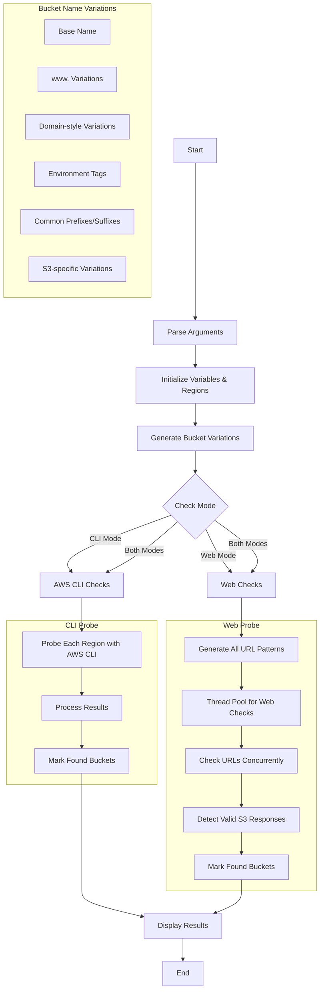

<a href="https://www.buymeacoffee.com/0xDTC"></a>

# AWS Security Scripts

## s3_regions.py

A comprehensive S3 bucket accessibility checker that tests for publicly accessible buckets across all AWS regions, using both AWS CLI and web-based checks.

### Features
- Tests bucket accessibility via HTTP and HTTPS
- Checks AWS CLI access across all AWS regions
- Tests over 70 bucket name variations and patterns
- Checks multiple URL formats for each bucket variation:
  - Direct bucket access (bucket.com)
  - Standard S3 endpoints (bucket.s3.amazonaws.com)
  - Regional endpoints (bucket.s3.region.amazonaws.com)
  - Hyphenated endpoints (bucket.s3-region.amazonaws.com)
  - Website endpoints (bucket.s3-website.region.amazonaws.com)
  - Dualstack endpoints (bucket.s3.dualstack.region.amazonaws.com)
- Covers all AWS regions including GovCloud and China regions
- Color-coded output (red for HTTP, green for HTTPS)
- Threaded concurrent processing for faster results
- Progress counter for visibility
- Real-time feedback on accessible buckets
- Automatic TLS/SSL certificate validation bypass for HTTPS endpoints
- Configurable concurrency via thread control

### Usage
```bash
python3 s3_regions.py -b bucket_name [-c] [-w] [-v] [-t THREADS]
```

Options:
- `-b, --bucket`: Specify the bucket name to check (required)
- `-c, --cli-only`: Only perform AWS CLI checks
- `-w, --web-only`: Only perform web checks
- `-v, --verbose`: Show verbose output (all attempts)
- `-t, --threads`: Number of concurrent threads for web checks (default: 30)

By default, both CLI and web checks are performed.

### Example
```bash
python3 s3_regions.py -b acme-corp.com
```

Example Output:
```
==== S3 Bucket Accessibility Check ====
Base name: acme-corp.com
Mode: Both Web and CLI checks
[AWS CLI] Found: s3://acme-corp.com No Region (objects: 1342)
[AWS CLI] Found: s3://acme-corp.com us-east-1 (objects: 1342)
[AWS CLI] Found: s3://acme-corp.com us-east-2 (objects: 1342)
[Web] Accessible: http://acme-corp.com.s3.amazonaws.com
[Web] Accessible: https://acme-corp.com.s3.amazonaws.com
[Web] Accessible: http://acme-corp.com.s3.us-west-2.amazonaws.com

Base bucket 'acme-corp.com' is accessible!
```

### Workflow
1. Parse command line arguments
2. Initialize variables and regions list
3. Generate bucket name variations
4. If CLI checks enabled:
   - Check bucket accessibility via AWS CLI across all regions
   - Track number of objects in each accessible bucket
5. If Web checks enabled:
   - Generate all endpoint URLs for each bucket variation
   - Check HTTP/HTTPS accessibility of each URL concurrently
   - Detect S3 bucket listings via `<ListBucketResult xmlns=` pattern
   - Report accessible buckets with color-coded URLs
6. Display summary of results

### Visual Workflow Diagram


### Bucket Name Variations
The script tests multiple variations of the provided bucket name, including:
- Base name
- www. prefix/suffix
- Domain-style variations
- Environment prefixes/suffixes (dev, staging, prod, etc.)
- Common prefixes/suffixes (logs, backups, assets, etc.)
- S3-specific variations
- Hyphen/underscore variants
- And many more...

### Requirements
- Python 3.6+
- AWS CLI (optional, for CLI checks)

### Note
This tool is for security testing purposes only. Use responsibly and with proper authorization.

## More coming soon
