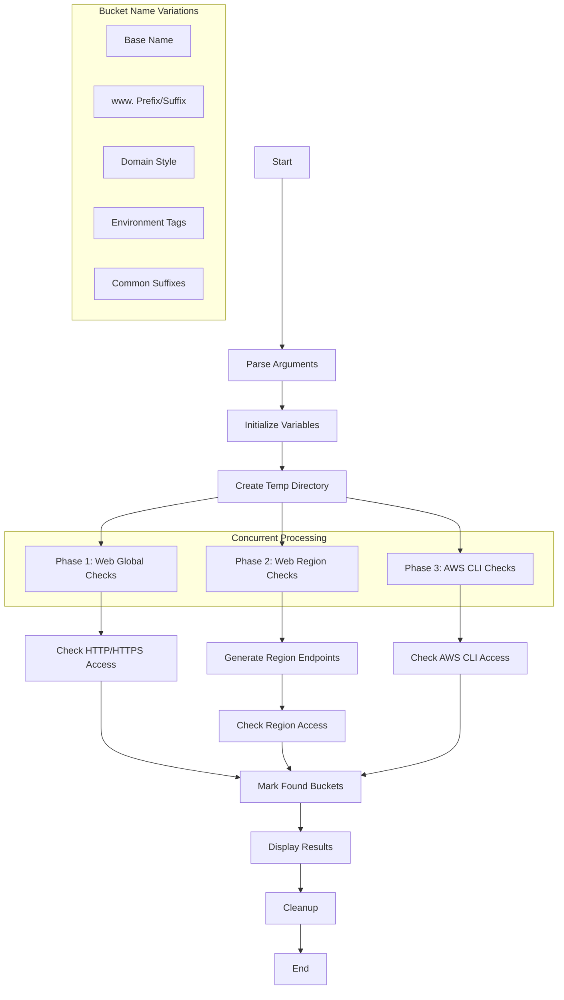

<a href="https://www.buymeacoffee.com/0xDTC"></a>

# AWS Security Scripts

## s3_regions.sh

A comprehensive S3 bucket accessibility checker that tests for publicly accessible buckets across all AWS regions.

### Features
- Tests bucket accessibility via HTTP and HTTPS
- Checks AWS CLI access with and without region specification
- Tests multiple bucket name variations and patterns
- Covers all AWS regions including GovCloud and China regions
- Prevents duplicate discoveries
- Color-coded output (red for HTTP, green for HTTPS)
- Concurrent processing for faster results
- No external dependencies required

### Usage
```bash
./s3_regions.sh -b bucket_name
```

### Example
```bash
./s3_regions.sh -b acme-corp
```

Example Output:
```
==== S3 Bucket Accessibility Check ====
Base name: acme-corp

======== S3 Web (Global) ========
[HTTP 200] Accessible: http://acme-corp.s3.amazonaws.com
[HTTPS 200] Accessible: https://acme-corp.s3.amazonaws.com

======== S3 Web (Region-based) ========
[HTTP 200] Accessible: http://acme-corp.s3.us-east-1.amazonaws.com
[HTTPS 200] Accessible: https://acme-corp.s3.us-east-1.amazonaws.com

======== AWS CLI ========
[AWS CLI] Found: s3://acme-corp (us-east-1)

Done. Found one or more accessible buckets above.
```

### Workflow Diagram


### Bucket Name Variations
The script tests multiple variations of the provided bucket name:
- Base name
- www. prefix/suffix
- Domain-style variations
- Environment prefixes/suffixes (dev, staging, prod)
- Common prefixes/suffixes (logs, backups, assets, etc.)
- S3-specific variations
- Hyphen/underscore variants
- And more...

### Requirements
- Bash shell
- curl
- AWS CLI (optional, for AWS CLI checks)

### Note
This tool is for security testing purposes only. Use responsibly and with proper authorization.

2. More coming soon
